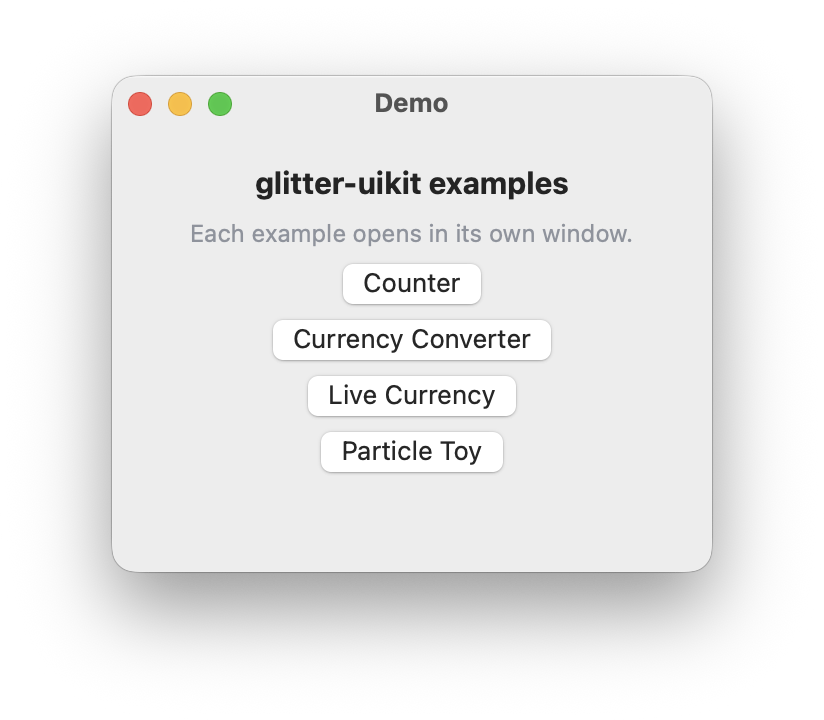
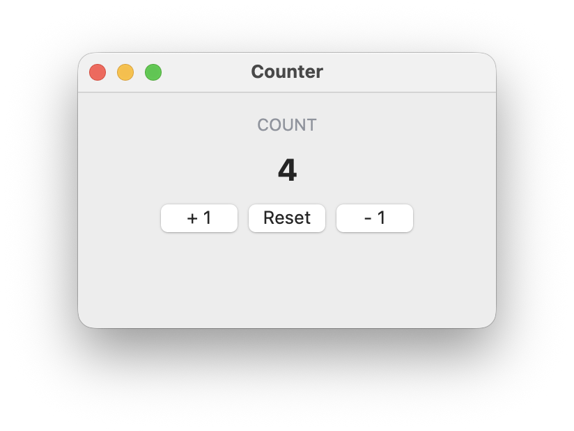
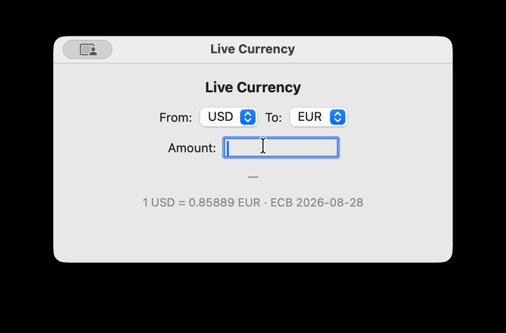

# uikit-demo

A demo of [glitter-uikit](https://github.com/jlt-commons/glitter-uikit),
the native macOS (AppKit) renderer for
[glitter](https://github.com/jlt-commons/glitter), a Replicant-style
reconciler for Clojure (well, [Jolt](https://github.com/jolt-lang/jolt),
native Clojure on Chez Scheme, no JVM anywhere). If you come from the
web: glitter is the reconciler, AppKit is the DOM. Hiccup goes in, real
`NSButton`s come out.


## Examples

| Preview | Window | What it shows |
|---|---|---|
|  | Hub | one button per registered example, derived from a registry each example joins with a single `require` line |
|  | Counter | the 7GUIs Counter task, and the template every other example follows |
|  | Currency Converter | a faithful port of *Learning Cocoa*'s 2001 example, its whole controller class dissolved into three `defmethod`s |
|  | Live Currency | a fiber-parked HTTPS fetch of real ECB rates, converting as you change currencies |
| — | Particle Toy | a CALayer-backed physics playground: click to burst, gravity and wall bounces settle it |

There's also a [screen recording](media/live-fx.mov) of Live Currency
fetching real rates as the currencies change, and two more Live
Currency captures, converting
[USD to EUR](media/fx-usd-eur.png) and, a moment later,
[USD to GBP](media/fx-usd-gbp.png).

**[Read the guide →](docs/guide/index.md)** for how the app is built,
the AppKit integration that isn't reconciled, the dependency pins and
why each one is exactly what it is, and what each example taught along
the way.

## Requirements

- [jolt](https://github.com/jolt-lang/jolt) 0.8.0 or newer
- `brew bundle` installs the rest: GTK4 (a transitive dependency of
  glitter's native layer, even though this demo renders pure AppKit),
  Graphviz, and ffmpeg

## Running

```bash
brew bundle
jolt demo     # run the app
jolt bundle   # AOT-compile it into Demo.app
jolt app      # open Demo.app
```

## Documentation

See [docs/guide/index.md](docs/guide/index.md).

## Origin

Adapted from Larry Staton's original
[glitter-uikit-demo](https://github.com/statonjr/glitter-uikit-demo),
which built the same app as a literate org-mode document. This copy
converts it into a conventional, hand-maintained Clojure project; the
original document's own history is the fuller account of how each
piece came to be.
