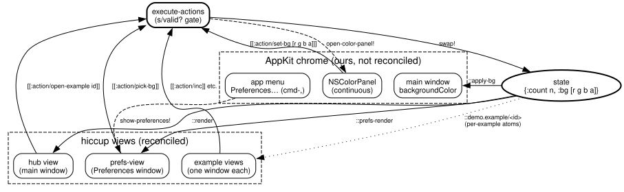

# Architecture

## Four namespaces, four layers

`demo.core` requires four glitter-uikit namespaces, each a distinct
layer. `app` is the `NSApplication` bootstrap: the run loop and the
cross-thread marshalling that lets a `swap!` from anywhere, an nREPL
eval included, land safely on the AppKit main thread. `appkit` is the
`IRender` implementation that mounts hiccup into a window. `ffi` is raw
`objc_msgSend` plus helpers, aliased `u` by convention. `widget` is the
widget factory and the shared ObjC target class, which the app reuses
directly for its own hand-rolled buttons (see
[AppKit integration](appkit-integration.md)). `glitter.core` is the
toolkit-agnostic reconciler underneath all of it, and `jolt.ffi` is
Jolt's own FFI layer, required directly wherever the app needs to bind
a CoreFoundation function glitter-uikit's `ffi` doesn't wrap.

`demo.registry` is the seam that makes the multi-window structure work,
described below. `demo.examples.*` are the four example namespaces,
each joining the hub with one require line in `demo.core`.

## The registry: two open multimethods

An example has to register itself with the hub, and the action
dispatcher has to accept kinds it has never heard of. Both are open
problems, so both live in `demo.registry`, a namespace small enough
that every example notebook can require it without creating a
dependency cycle (`demo.core` requires the examples, and the examples
require only `demo.registry`, never `demo.core`).

Two multimethods carry the pattern:

- `run-action!` dispatches on an action's kind. Each example
  `defmethod`s its own actions right next to the feature they serve,
  instead of collecting them in one growing `case`.
- `action-spec` returns the spec for each kind and knits every example's
  contribution into one open spec with `s/multi-spec`, so validation
  stays ahead of every FFI call. An unknown kind has no method and is
  invalid by construction: a typo in an `:on {:click ...}` vector
  produces a loud `explain`, not a silently swallowed no-op.

This grew out of something simpler that stopped working. The app's
first dispatcher was a closed `case` over a closed `s/or` spec, which
served fine while there was one example. It couldn't learn a kind it
had never seen, so it couldn't survive the hub. The shape is worth
remembering, because every closed dispatcher looks reasonable right
before it needs to grow.

## State, view, actions

Every window follows Replicant's pattern: one atom holds the world,
`mount!` watches it, and each `swap!` re-reconciles the view. The
renderer marshals that reconciliation onto the AppKit main thread, so
the swap itself is safe to call from anywhere.

Views are pure `state -> hiccup` functions. `:vbox` and `:hbox` are
literally `NSStackView`s with the orientation preset, and a bare string
child becomes its own `NSTextField` label, so ordinary stack view
behavior applies throughout. Two conventions appear in every view:
`:margin` sets edge insets on the stack, and `:markup` takes
Pango-style hiccup (`[:span {:size "large" :weight "bold"} ...]`)
rendered to an `NSAttributedString`.

Events carry pure data, `[[:action/inc]]`, and the one dispatcher
interprets them, checking the whole batch against `::actions` before
running any handler in it. The event map each handler receives also
carries `:glitter/appkit-view`, the raw sender pointer, as an escape
hatch into AppKit when a handler genuinely needs it.

One gotcha worth flagging up front, because it cost a real bug in the
Currency Converter: an entry's typed value arrives as
`:glitter/value`, but one level down from where you'd look. The
renderer puts `:glitter/value` in its raw event map, and
`glitter.core/build-event-map` nests that whole map under
`:glitter/dom-event` before the dispatcher ever sees it. `event-value`
in `demo.registry` does the `get-in` once so no example has to
rediscover this.

## Mounting a second window

`appkit/mount!` watches its state atom under a hardcoded key,
`::appkit/render`. Clojure's `add-watch` is last-writer-wins per key, so
a second `mount!` call on the *same atom* silently replaces the first
window's watch, and that window stops re-rendering. Every window this
app opens beyond the hub, the Preferences window and each example
window, calls `mount-second!` instead, which is `mount!`'s wiring
verbatim with the watch key taken as a parameter. Each open example
window keeps its own key, `(keyword "demo.example" (name id))`, so
opening a second example never displaces the first.

## Dataflow

Actions flow from any window into `execute-actions`, which validates
the batch and dispatches each one. A handler either swaps `state`
directly or, for the two effectful preferences actions, reaches into
AppKit chrome the reconciler doesn't own (opening the shared
`NSColorPanel`, showing the Preferences window). One `swap!` then fans
out through three independently keyed watches: the hub's own render,
the Preferences window's render, and a plain background-color watch
that sets the main window's `backgroundColor` directly, since that
property is chrome the reconciler never touches.
